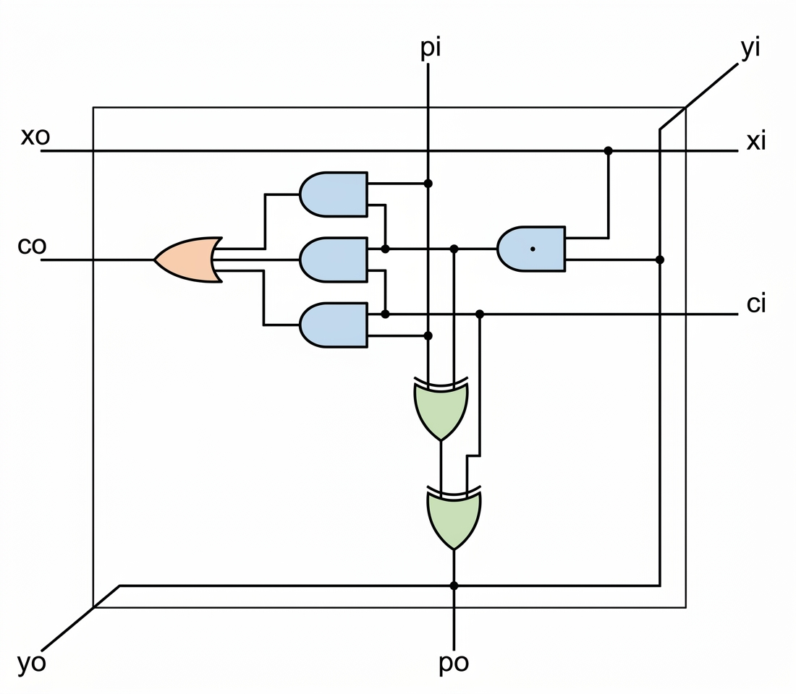
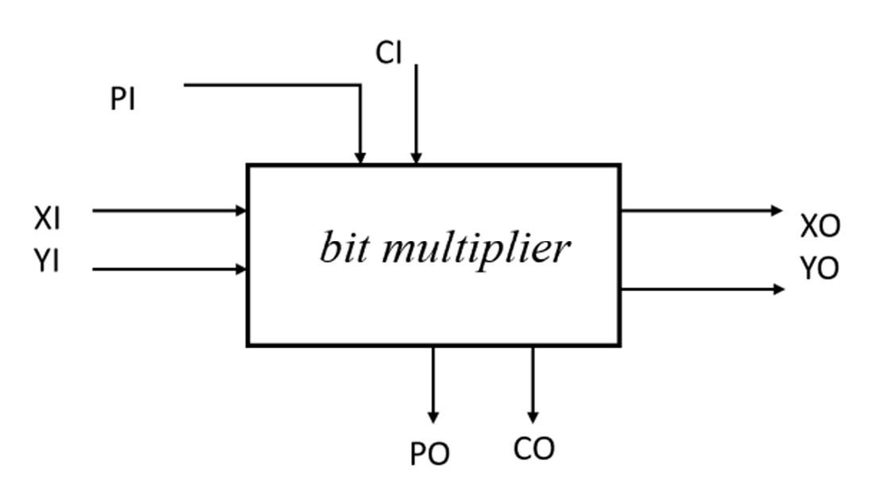
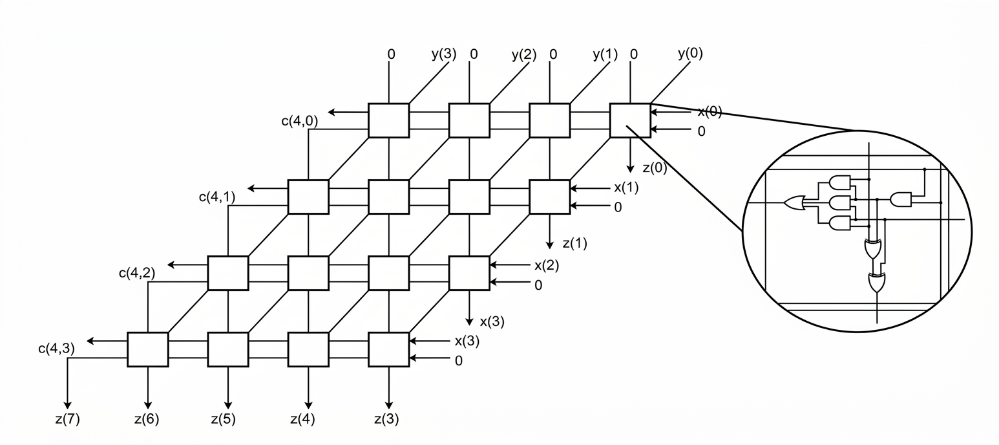

# Configurable Neural Network Hardware Accelerator

This repository contains the VHDL implementation of a scalable and configurable hardware accelerator for Multilayer Perceptron (MLP) neural networks. The design is highly parameterized, allowing dynamic configuration of network topology, layer sizes, and bit-widths. 

It was designed as part of the Digital System Design course (Spring 2026).

## Key Features
- **Array-Based Parallel Multiplier:** A fully combinational 2D mesh grid for fast hardware multiplication (generic $M \times N$ bit-widths).
- **Signed Arithmetic Wrapper:** Two's complement support wrapper for inherently unsigned multipliers, allowing negative weights and activations.
- **Optimized Adder Tree:** Structural logarithmic adder tree for MAC (Multiply-Accumulate) operations.
- **Activation & Decision:** Parameterized ReLU unit and a resource-efficient, purely combinational Argmax unit for final classification (bypassing complex softmax modules).
- **Dynamic Topology:** Easy adjustment of layer counts and neurons via VHDL generics (`TOPOLOGY` array), with dynamic bus slicing for flattened weight/bias arrays.
- **Verification:** Evaluated using the MNIST dataset, achieving >93% inference accuracy.

### Architecture & Key Modules

The system consists of the following key modules:

#### 1. Array Multiplier
**`ARRAY_MULTIPLIER`**: The core bit-level matrix multiplication unit constructed using a regular 2D grid of full adders and AND gates.

  
   
  <em>Figure 1: Internal logic cell of the 1-bit multiplier</em>

  

  
   
  <em>Figure 2: 4x4 Parallel Array Multiplier Architecture</em>

#### 2. Matrix Multiplier
**`MATRIX_MULTIPLIER`**: Instantiates parallel dot-product computations for all neurons across a layer using structural `GENERATE` statements.

#### 3. Activation & Classification
**`RELU / ARGMAX`**: Non-linear activation and terminal classification stages.

#### 4. Top-Level Module
**`MLP (Top-Level)`**: Connects multiple layers dynamically based on configuration parameters and controls multi-layer data flow.

- `MATRIX_MULTIPLIER`: Instantiates parallel dot-product computations for all neurons across a layer using structural `GENERATE` statements.
- `RELU` / `ARGMAX`: Non-linear activation and terminal classification stages.
- `MLP` (Top-Level): Connects multiple layers dynamically based on the configuration arrays and handles multi-layer data flow.

## Tools & Synthesis
- **Language:** VHDL (IEEE standard libraries: `IEEE.STD_LOGIC_1164`, `IEEE.NUMERIC_STD`, `MATH_REAL`)
- **Simulation:** Standard testbenches with pseudorandom stimulus generation and MNIST test vectors.
- **Synthesis:** The multiplier core synthesizes to standard cells (~20.9k cells, 0% sequential) ensuring a purely combinational datapath prior to pipelining.

